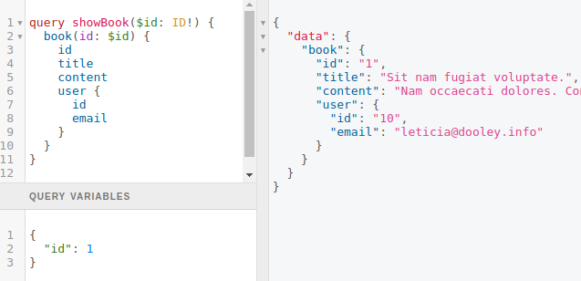
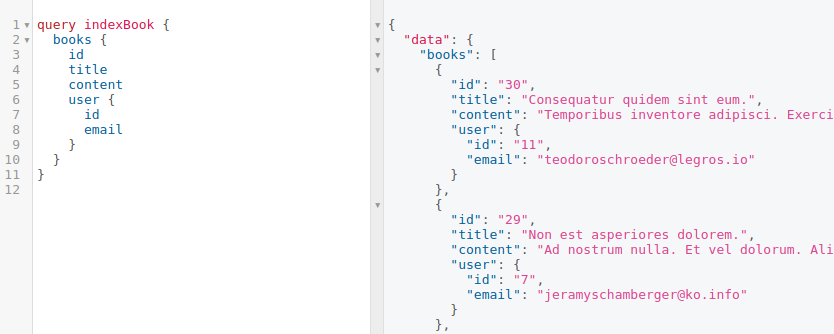
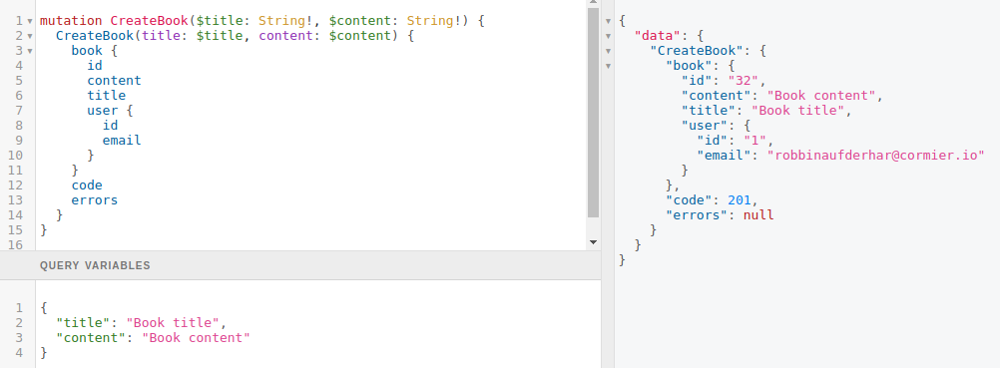
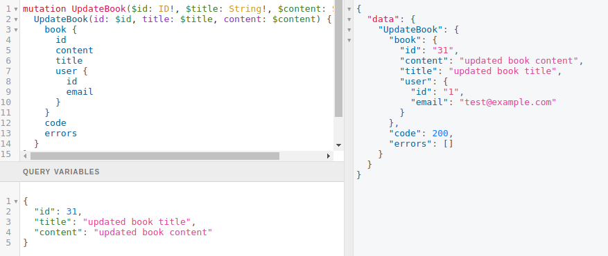

# BookGQL

```bash
git clone git@github.com:sonyged/GraphQL-Playground.git
cd BookGQL
```

- For docker setup

  ```bash
  script/docker/setup.sh
  script/docker/start.sh
  ```

- For non docker setup

  ```bash
  bundle install
  rails db:create db:migrate db:fake
  rails s
  ```

sign in at http://localhost:3000/users/sign_in

email: test@example.com

password: test123456

then access to GraphiQL at http://localhost:3000/graphiql

## Show a book

- Query

```graphql
query showBook($id: ID!) {
  book(id: $id) {
    id
    title
    content
    user {
      id
      email
    }
  }
}
```

- Variable

```ruby
{
  "id": 1
}
```



## List all books

- Query

```graphql
query indexBooks {
  books {
    id
    title
    content
    user {
      id
      email
    }
  }
}
```



## Create a book

- mutation

```graphql
mutation CreateBook($title: String!, $content: String!) {
  CreateBook(title: $title, content: $content) {
    book {
      id
      content
      title
      user {
        id
        email
      }
    }
    code
    errors
  }
}
```

- Variable

```ruby
{
  "title": "Book title",
  "content": "Book content"
}
```



## Update a book

- mutation
  - You can update only book that you create

```graphql
mutation UpdateBook($id: ID!, $title: String!, $content: String!) {
  UpdateBook(id: $id, title: $title, content: $content) {
    book {
      id
      content
      title
      user {
        id
        email
      }
    }
    code
    errors
  }
}
```

- Variable

```ruby
{
  "id": 31,
  "title": "updated book title",
  "content": "updated book content"
}
```



## Authorization

- showBook: user required
  - access book created_at: admin required
  - view book's author: admin required
- indexBook: user required
- createBook: user required
- updateBook: owner required
